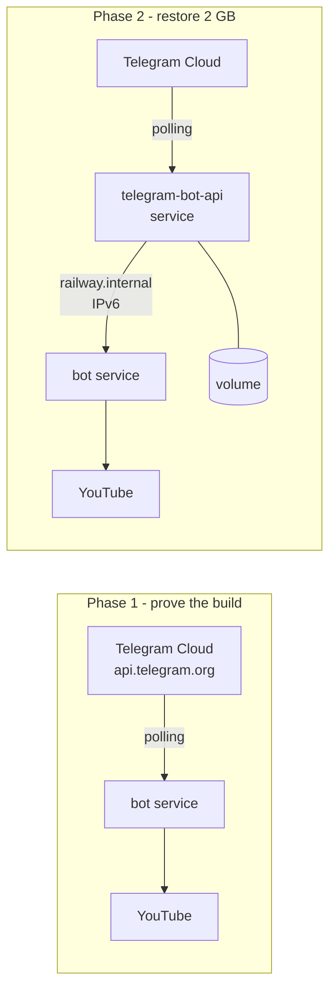

# Deploying the YouTube→Audio bot to Railway

## Important: no functionality is removed

The local Bot API Server support stays in the codebase. Currently [`bot.py:38-40`](../bot.py:38) *always* routes through a local server, so the bot cannot run without one. The change turns that into a branch driven by `LOCAL_API_BASE_URL`:

- variable set → local server, 2 GB limit (today's exact behavior, `docker-compose.yml` keeps working locally)
- variable empty → `api.telegram.org`, 50 MB limit

Same code, now switchable.

## Strategy

Two phases, for debugging isolation. If both services go up at once and the bot goes silent, the cause could be the build, the token, `logOut` state, or Railway's IPv6-only private networking — and `railway logs` won't tell them apart. Phase 1 proves the image builds with `ffmpeg`, the token works, and polling runs. Phase 2 then changes exactly one variable, so a failure points at the networking.

The 50 MB ceiling in Phase 1 is a temporary setup state, not the destination.



## Phase 0 — Security, do this first

`TELEGRAM_API_ID` and `TELEGRAM_API_HASH` are hardcoded in [`docker-compose.yml:8-9`](../docker-compose.yml:8), and [`.gitignore`](../.gitignore:1) only covers `.env`. Those credentials are already in Git history.

1. https://my.telegram.org → API development tools → reissue the application.
2. Put the new values only in Railway variables and a local untracked `.env`.
3. If the repo was ever pushed to a public remote, rewrite history (`git filter-repo`) or recreate the repo.
4. Replace the literals in `docker-compose.yml` with `${TELEGRAM_API_ID}` / `${TELEGRAM_API_HASH}` — Compose reads `.env` from the project root automatically.

Phase 1 needs only `BOT_TOKEN`, but the leak needs closing regardless.

## Phase 1 — Single service on Railway

### Step 1. Make the local server optional in `bot.py`

Target behavior:

- Read `LOCAL_API_BASE_URL` defaulting to an **empty string**, not `http://localhost:8081`. The current default at [`bot.py:23`](../bot.py:23) would make the Railway container try to reach itself and hang.
- Non-empty → build `AiohttpSession(api=TelegramAPIServer.from_base(url, is_local=True))` exactly as today.
- Empty → `bot = Bot(token=BOT_TOKEN)`, which targets `api.telegram.org`.
- Derive `MAX_FILESIZE_MB` from the same condition: `2000` local, `50` cloud. The hardcoded `2000` at [`bot.py:29`](../bot.py:29) would otherwise let the bot attempt a 300 MB upload and surface a raw Telegram error instead of the friendly message at [`bot.py:97`](../bot.py:97).
- Log the selected mode at startup so `railway logs` shows it immediately.

### Step 2. Pre-download size guard

With a 50 MB ceiling, an oversized video only fails *after* download and conversion — wasted CPU and egress, both metered. Add a cheap check in `download_audio` ([`bot.py:49`](../bot.py:49)):

- `ydl.extract_info(url, download=False)` first, read `duration`.
- At the 192 kbps set in [`bot.py:58`](../bot.py:58), mp3 size ≈ `duration_seconds × 24 KB`, so 50 MB ≈ ~35 minutes.
- If the estimate exceeds `MAX_FILESIZE_MB`, tell the user and skip the download.

This stays useful in Phase 2 — it just compares against 2000 instead.

### Step 3. `Dockerfile`

Railway auto-detects a Dockerfile and prefers it over Nixpacks. This is the reliable route because `ffmpeg` ([`bot.py:56`](../bot.py:56)) is a system binary Nixpacks' Python provider won't install by default.

```dockerfile
FROM python:3.12-slim

RUN apt-get update \
    && apt-get install -y --no-install-recommends ffmpeg ca-certificates \
    && rm -rf /var/lib/apt/lists/*

WORKDIR /app

COPY requirements.txt .
RUN pip install --no-cache-dir -r requirements.txt

COPY bot.py .

RUN useradd -m -u 1000 botuser && mkdir -p /app/downloads && chown -R botuser:botuser /app
USER botuser

CMD ["python", "-u", "bot.py"]
```

`-u` is not optional: without unbuffered output, the `logging` calls from [`bot.py:36`](../bot.py:36) sit in a buffer and `railway logs` looks empty — indistinguishable from a crashed service.

This same Dockerfile serves local `docker compose` use, so add a `build: .` bot service there too if you want parity.

### Step 4. `.dockerignore`

```
.env
venv/
downloads/
__pycache__/
*.pyc
.git/
plans/
```

Railway uploads the build context on every deploy; a populated local `downloads/` would make deploys slow.

### Step 5. Push to GitHub

Railway's GitHub integration redeploys on every push. Before pushing, confirm `.env` is untracked (`git status --porcelain` must not list it) and extend [`.gitignore`](../.gitignore) per Step 9.

### Step 6. Create the service

1. Railway dashboard → **New Project** → **Deploy from GitHub repo**.
2. Railway detects the Dockerfile and builds. First build is slow due to the `ffmpeg` apt layer.
3. **Do not** generate a domain. This is a polling worker with no HTTP listener. Railway may warn that no port was detected — expected and harmless.

### Step 7. Variables

Service → **Variables**:

| Variable | Value |
|---|---|
| `BOT_TOKEN` | token from @BotFather |

Leave `LOCAL_API_BASE_URL` unset; Step 1 makes unset mean "use the cloud API."

### Step 8. `/close` if the token was used locally

If this token ever talked to a local Bot API Server, `api.telegram.org` will reject it. Run once:

```bash
curl "https://api.telegram.org/bot<TOKEN>/close"
```

The opposite direction uses `/logOut` — that's Phase 2, Step 5.

### Step 9. Housekeeping

- **[`.gitignore`](../.gitignore)** has one line. Add `venv/`, `__pycache__/`, `*.pyc`, `downloads/`, `cookies.txt`.
- **Temp cleanup** — the `finally` block at [`bot.py:112-116`](../bot.py:112) deletes a fixed extension list; yt-dlp also leaves `.mp4`, `.opus`, `.f140.*`. Delete by glob on `downloads/<uuid>*` instead.
- **Concurrency** — `run_in_executor(None, ...)` at [`bot.py:91`](../bot.py:91) uses the default thread pool. On a shared-CPU container two simultaneous conversions make both crawl. Gate with `asyncio.Semaphore(1)`.
- **`downloads/`** is ephemeral on Railway, which is fine — files are deleted right after sending. No volume needed in Phase 1.
- **`.env.example`** — [`README.md:50`](../README.md:50) references it but the file doesn't exist. Create it with `BOT_TOKEN`, `TELEGRAM_API_ID`, `TELEGRAM_API_HASH`, `LOCAL_API_BASE_URL`.

### Step 10. Verify

```bash
railway logs   # or dashboard → Deployments → Logs
```

Expect the Step 1 startup line confirming cloud mode. Send a short YouTube link and confirm the mp3 arrives. Then send a long video and confirm you get the friendly size message from Step 2, not a traceback.

## Phase 2 — Restore the 2 GB limit

1. Same project → **New Service** → **Docker Image** → `aiogram/telegram-bot-api:latest`.
2. Variables on that service: reissued `TELEGRAM_API_ID`, `TELEGRAM_API_HASH`, and `TELEGRAM_LOCAL=1`.
3. Attach a **Volume** at `/var/lib/telegram-bot-api`. Without it, in-flight files land on ephemeral disk and vanish on restart.
4. On the bot service, set `LOCAL_API_BASE_URL=http://<api-service-name>.railway.internal:8081`. Step 1's branch picks up the local path and raises the limit to 2000 automatically.
5. Run `curl "https://api.telegram.org/bot<TOKEN>/logOut"` once, or the local server refuses the token.
6. Do not expose the API service publicly — a reachable local Bot API Server accepts requests bearing *any* bot token.

**The IPv6 catch.** Railway private networking resolves `*.railway.internal` to AAAA records only, while `telegram-bot-api` binds IPv4 by default, so the connection may fail. Fix by making it listen on IPv6 (`--http-ip-address=::` or the image's equivalent env var). Expect to spend debugging time here specifically — this is the reason Phase 1 exists.

**Disk math.** A 2 GB file is briefly stored twice: the bot's `downloads/` plus the API server's volume. Hobby-plan volumes cap at 5 GB.

**Rollback.** If Phase 2 misbehaves, clear `LOCAL_API_BASE_URL` on the bot service and run `/close` — you're back to a working Phase 1 without a redeploy.

## Cost and the YouTube-IP risk

- Railway meters CPU, memory, and **egress**. Each delivered file costs traffic twice (download in, upload out). Watch the usage graph the first week before assuming the $5 credit covers your volume.
- yt-dlp from any datacenter IP frequently hits `Sign in to confirm you're not a bot`. This affects Railway and VPSes equally; it won't reproduce on your local machine. Mitigations in increasing effort: redeploy regularly to pick up newer yt-dlp; supply `cookies.txt` and wire it into `ydl_opts` at [`bot.py:51`](../bot.py:51); last resort, a residential proxy. Build the cookies hook as optional now (read path from an env var, use it only if the file exists) so it becomes a config change later rather than a code change.

## Change summary

| File | Action |
|---|---|
| `Dockerfile` | create |
| `.dockerignore` | create |
| `.env.example` | create |
| `bot.py` | conditional session, dynamic `MAX_FILESIZE_MB`, duration pre-check, glob cleanup, semaphore, optional cookies |
| `.gitignore` | extend |
| `docker-compose.yml` | secrets to `${...}`; optionally add a `build: .` bot service |
| `README.md` | replace the Deploy section at [`README.md:83`](../README.md:83) |
